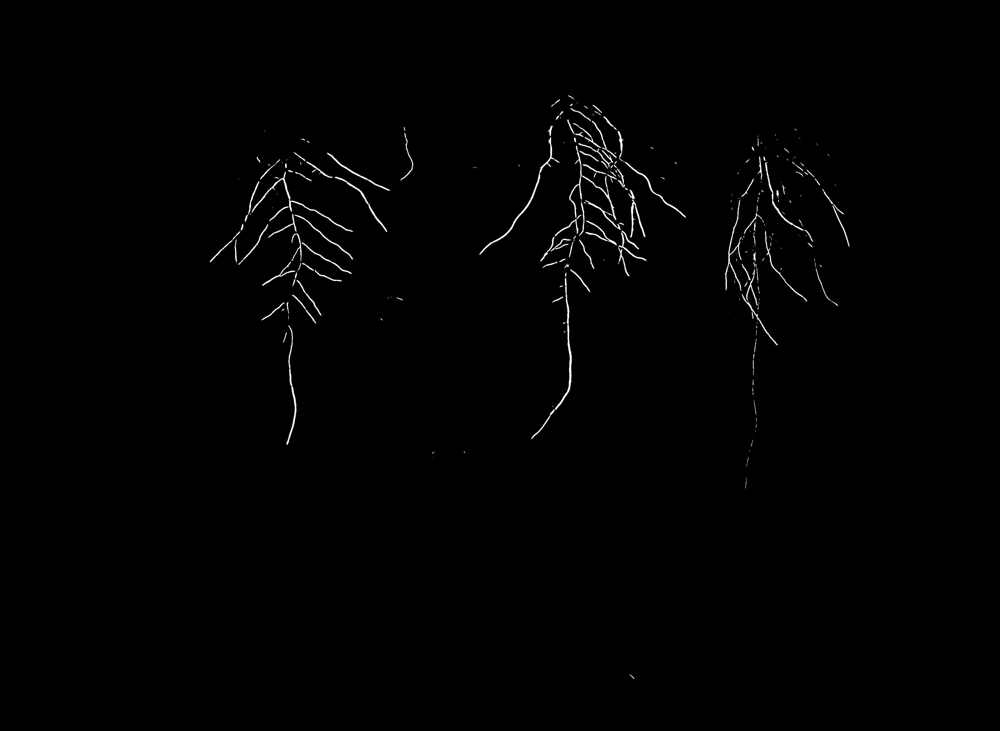

# Task 5 (Year 2, Block B) — U-Net root segmentation

**Status:** Demo / archived — model and notebooks included.  
This folder contains a trained U-Net model and notebooks to reproduce the inference (mask prediction) and to train/assess the model.

---

## Files in this folder

- `rafal_234778_unet_model_256px.h5`  
  Saved U-Net model (Keras `.h5`) trained to segment plant roots.
- `task5_test_image.png`  
  Example input image (plant) used for inference/demo.
- `task5_test_image_prediction_rafal_234778.png`  
  Segmentation mask produced by the model for `task5_test_image.png`.
- `task5_inference_template.ipynb`  
  Notebook that crops `task5_test_image.png` and creates `task5_test_image_prediction_rafal_234778.png` by running the inference pipeline.
- `task5_training_template.ipynb`  
  Notebook with training & evaluation code for the U-Net model.

---

## Quick demo (in README)
Input image:  

Predicted mask:  
